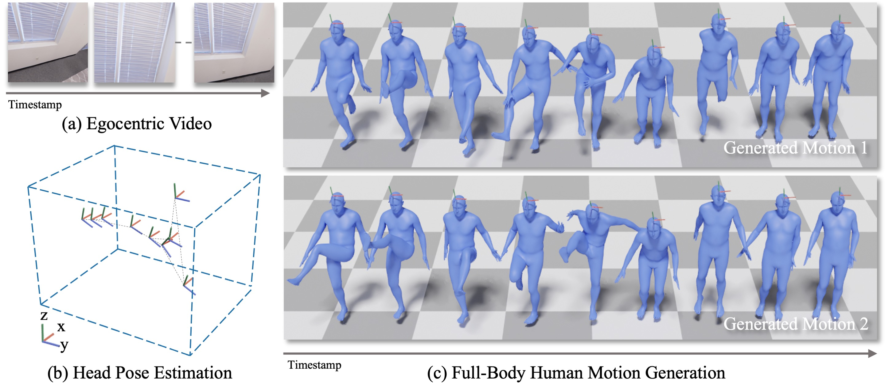

# Ego-Body Pose Estimation via Ego-Head Pose Estimation (CVPR 2023)
This is the official implementation for the CVPR 2023 [paper](https://arxiv.org/abs/2212.04636). For more information, please check the [project webpage](https://lijiaman.github.io/projects/egoego/).



## Environment Setup
> Note: This code was developed on Ubuntu 20.04 with Python 3.8, CUDA 11.3 and PyTorch 1.11.0.

Clone the repo.
```
git clone https://github.com/lijiaman/egoego.git
cd egoego/
```
Create a virtual environment using Conda and activate the environment. 
```
conda create -n egoego_env python=3.8
conda activate egoego_env 
```
Install PyTorch. 
```
conda install pytorch==1.11.0 torchvision==0.12.0 torchaudio==0.11.0 cudatoolkit=11.3 -c pytorch
```
Install PyTorch3D. 
```
conda install -c fvcore -c iopath -c conda-forge fvcore iopath
conda install -c bottler nvidiacub
pip install --no-index --no-cache-dir pytorch3d -f https://dl.fbaipublicfiles.com/pytorch3d/packaging/wheels/py38_cu113_pyt1110/download.html
```
Install human_body_prior. 
```
git clone https://github.com/nghorbani/human_body_prior.git
pip install tqdm dotmap PyYAML omegaconf loguru
cd human_body_prior/
python setup.py develop
```
Install ```mujoco```. 
```
wget https://github.com/deepmind/mujoco/releases/download/2.1.0/mujoco210-linux-x86_64.tar.gz
tar -xzf mujoco210-linux-x86_64.tar.gz
mkdir ~/.mujoco
mv mujoco210 ~/.mujoco/
export LD_LIBRARY_PATH=$LD_LIBRARY_PATH:~/.mujoco/mujoco210/bin
```
Install other dependencies. 
```
pip install evo --upgrade --no-binary evo
pip install -r requirements.txt 
```

### Quick Start 
First, download pretrained [models](https://drive.google.com/drive/folders/1llKvkTg0v-eqXGlIrEJYNqUqXAE0x8GK?usp=sharing) and put ```pretrained_models/``` to the root folder.  

If you would like to generate visualizations, please download [Blender](https://www.blender.org/download/) first. And put blender path to blender_path. Replace the blender_path in line 45 of ```egoego/vis/blender_vis_mesh_motion.py```. 

Please download [SMPL-H](https://mano.is.tue.mpg.de/download.php) (select the extended SMPL+H model) and put the model to ```smpl_models/smplh_amass/```. If you have a different folder path for SMPL-H model, please modify the path in line 13 of ```egoego/data/amass_diffusion_dataset.py```.

Then run EgoEgo pipeline on the testing data. This will generate corresponding visualization results in folder ```test_data_res/```. To disable visualizations, please remove ```--gen_vis```. 
```
sh scripts/test_egoego_pipeline.sh
```

### Datasets
If you would like to train each module of our pipeline and evaluate, please prepare the following datasets. 

#### AMASS
Please download AMASS data following the instructions on the [website](https://amass.is.tue.mpg.de/index.html). 

We used SMPL-H data for this project. Please put AMASS data to a folder ```data/amass```.

```
cd utils/data_utils 
python process_amass_dataset.py 
python convert_amass_to_qpos.py 
```

Please replace the data path with your desired path in the file before running. 

#### ARES 
ARES dataset relies on AMASS. Please processing AMASS data following above instruction first before processing ARES.

First, download egocentric videos and data that contains AMASS sequence information using this [link](https://drive.google.com/drive/folders/12L3lY87vYtBn9IB9bXUAyHrETYnezlKQ?usp=sharing). 

Please put the data to a folder ```data/ares```. Uncompress the files in ```ares_ego_videos```. 

To extract corresponding motion sequences from AMASS for each egocentric video, please run the following command. This will copy each egocentric video's corresponding motion to ```data/ares/ares_ego_videos/scene_name/seq_name/ori_motion_seq.npz```.

```
cd utils/data_utils 
python extract_amass_motion_for_ares.py
```

To prepare data used during training, run this command to convert all the motion sequences into a single data file. Please check data path before you proceed. 

```
python process_ares_dataset.py
```

To prepare data used during evaluation, run this command to convert data format to be consistent with kinpoly. Please check data path before you proceed. 

```
python convert_ares_to_qpos.py 
```

#### Kinpoly
Please download Kinpoly data following the instructions in this [repo](https://github.com/KlabCMU/kin-poly). 

Put MoCap dataset to folder ```data/kinpoly-mocap/```.

Put RealWorld dataset to folder ```data/kinpoly-realworld/```. 

#### GIMO
Please download GIMO data following the instructions in this [repo](https://github.com/y-zheng18/GIMO).

To process GIMO, please do the following. 
```
cd utils/data_utils/gimo_utils
python segment_seq_images.py
```
Then extract pose parmaters from Vposer.
```
python extract_pose_params.py
```
Process GIMO to be consistent with AMASS processed data.
```
cd utils/data_utils
python process_gimo_data.py
```
Process GIMO data to the format used for training and evaluation.
```
cd utils/data_utils
python convert_gimo_to_qpos.py 
```

#### Others

We used [DROID-SLAM](https://github.com/princeton-vl/DROID-SLAM) to extract camera poses. We also provided results of DROID-SLAM for ARES, Kinpoly-MoCap, GIMO [here](https://drive.google.com/drive/folders/1hoWdQKXoX4Hc7FGtNcJqmo6fO9QoGKEw?usp=drive_link). Please find the results for each dataset and put them into desired path ```data/ares/droid_slam_res/```, ```data/gimo/droid_slam_res/```, ```data/kinpoly-mocap/droid_slam_res```, ```data/kinpoly-realworld/droid_slam_res/```. 

We used [RAFT](https://github.com/princeton-vl/RAFT) to extract optical flow, we provided optical flow features extracted using a pre-trained ResNet [here](https://drive.google.com/drive/folders/1hoWdQKXoX4Hc7FGtNcJqmo6fO9QoGKEw?usp=drive_link). Please find the results for each dataset and put them into desired path ```data/ares/raft_of_feats```, ```data/gimo/raft_of_feats```, ```data/kinpoly/fpv_of_feats```. 

### Evaluation
Evaluate the conditional diffusion model at stage 2 on AMASS testing split. This part only relies on AMASS data. To generate visualizations, please add ```--gen_vis```. 
```
sh scripts/eval_stage2.sh 
```

Evaluate the whole EgoEgo pipeline on ARES, GIMO, Kinpoly-MoCap. Please use ```--test_on_ares```, ```--test_on_gimo```, and ```--eval_on_kinpoly_mocap``` respectively. To generate visualizations, please add ```--gen_vis```. Note that before proceeding, please download the [sequence names](https://drive.google.com/drive/folders/1z6Ds4WZ5wgmJw4zX5HW2uWksaFxAv6D2) that are not included in quantitative evaluation as DROID-SLAM failed in these sequences. Our approach relies on a reasonable SLAM result. Put the folder to ```data/failed_seq_names/```. 
```
sh scripts/eval_egoego_pipeline_on_ares.sh
sh scripts/eval_egoego_pipeline_on_gimo.sh
sh scripts/eval_egoego_pipeline_on_kinpoly.sh
``` 

In ```utils/blender_utils``` folder, we provided multiple ```.blend``` files as reference for you to generate visualizations. You can try different .blend or customize your own visualization by modifying ```.blend``` using Blender. 

### Training
For all the script used in training, please modify ```--entity``` to your username on [wandb](https://wandb.ai/site) to monitor the training loss. 
#### Training Conditional Diffusion Model for Full-Body Generation from Head Pose 
Train conditional diffusion on AMASS.
```
sh scripts/train_full_body_cond_diffusion.sh 
```

#### Training GravityNet 
```
sh scripts/train_gravitynet.sh
```

#### Training HeadNet 
Train HeadNet on ARES.
``` 
sh scripts/train_headnet_on_ares.sh
```

Train HeadNet on GIMO. 
```
sh scripts/train_headnet_on_gimo.sh
```

Train HeadNet on Kinpoly-Realworld. 
```
sh scripts/train_headnet_on_kinpoly.sh
```

### Citation
```
@inproceedings{li2023ego,
  title={Ego-Body Pose Estimation via Ego-Head Pose Estimation},
  author={Li, Jiaman and Liu, Karen and Wu, Jiajun},
  booktitle={Proceedings of the IEEE/CVF Conference on Computer Vision and Pattern Recognition},
  pages={17142--17151},
  year={2023}
}
```

### Related Repos
We adapted some code from other repos in data processing, learning, evaluation, etc. Please check these useful repos. 
```
https://github.com/lucidrains/denoising-diffusion-pytorch
https://github.com/davrempe/humor
https://github.com/KlabCMU/kin-poly 
https://github.com/jihoonerd/Conditional-Motion-In-Betweening 
https://github.com/lijiaman/motion_transformer 
``` 
